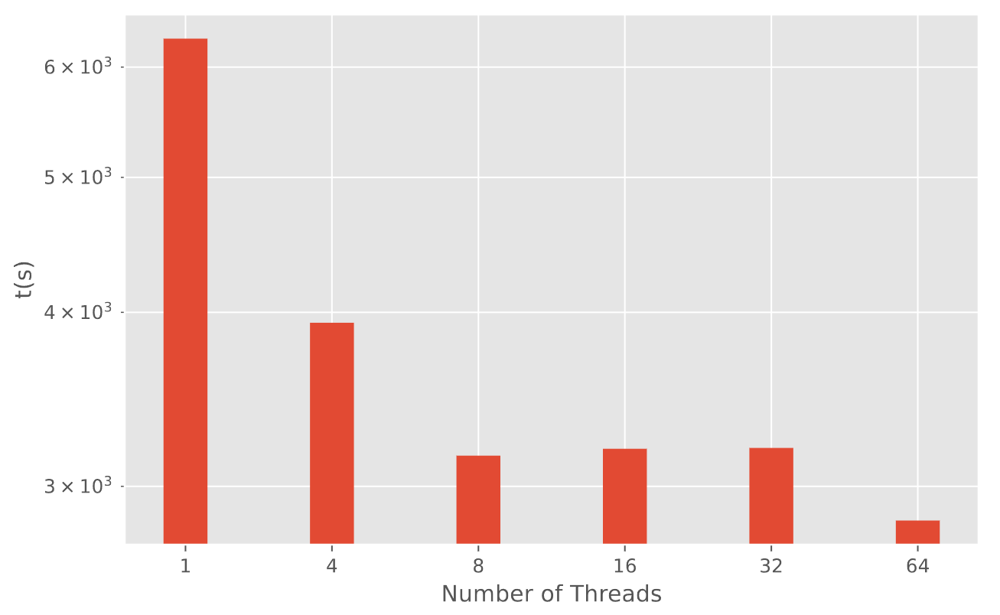

# VQC benchmark


## Introduction

Welcome to VQC, a highly efficient and light-weight simulator for variational quantum circuits. VQC is crafted to simulate the *Zuchongzhi* quantum processors classically, playing a critical role in characterizing circuit noises, contributing to the Schrödinger-Feynman algorithm for validation and benchmarking, and optimizing variational quantum algorithms.

The core philosophy behind VQC is threefold:

1. **Transparency:** The simulator's core algorithms are transparently implemented in the high-performance scripting language Julia, ensuring clarity and maintainability.
2. **Efficiency:** We prioritize efficiency, with a cache-optimized implementation of elementary operations and support for shared-memory parallelization to speed up computations.
3. **Automatic Differentiation:** VQC natively supports automatic differentiation, a crucial feature for both noiseless and noisy quantum circuit simulations.

This repository presents the benchmarking code and results that showcase VQC's capabilities in comparison to other simulators.

## Paper

Our work has been detailed in a paper titled "VQC: an Efficient Variational Quantum Circuit Simulator for Near-Term Quantum Algorithms". We encourage you to read the paper for a comprehensive understanding of the algorithms and methodologies employed by VQC. [Link to paper](#)

## Getting Started

These instructions will get you a copy of the project up and running on your local machine for development and testing purposes.

### Prerequisites

Before you can run the benchmarks, make sure you have the following software installed:

- Python 3.8 or later
- Julia 1.6 or later
- Pip

### Installation

First, clone the VQC benchmark repository:

```bash
git clone https://github.com/weiyouLiao/VQC-benchmark.git
cd vqc-simulator
```

### Environment Setup

To replicate the benchmark environment, we recommend using a virtual environment:

```bash
python -m venv benchmark-env
source benchmark-env\bin\activate  # On Windows use `\benchmark-env\Scripts\activate`
```

After activating the environment, install the Python dependencies:

```bash
pip install -r requirements.txt
```

For the Julia dependencies, start the Julia REPL by typing `julia` in your terminal and set up the project environment:

```julia
using Pkg
Pkg.activate(".")
Pkg.instantiate()
```

## Dependencies

List of major dependencies and their versions used in the benchmark:

| Library             | Version  |
| ------------------- | -------- |
| ProjectQ            | 0.8.0    |
| Qulacs              | 0.6.3    |
| Qiskit              | 0.45.3   |
| Qiskit-aer          | 0.13.2   |
| Pennylane           | 0.34.0   |
| Pennylane-lightning | 0.34.0   |
| Yao                 | 0.8.13   |
| VQC                 | 0.0.1    |
| pytest-benchmark    | 4.0.0    |
| mkl                 | 2024.0.0 |
| numpy               | 1.26.3   |

## Running the Benchmarks

The benchmarks are divided into four main parts:

1. **Single Gate Operation Benchmarks** - Tests the performance of individual quantum gate operations.
2. **Quantum Circuit and Variational Quantum Circuit Benchmarks** - Evaluates the performance of quantum and variational quantum circuits.
3. **VQC Parallelization Test** - Assesses the parallelization capabilities of VQC.
4. **VQC Noisy Automatic Differentiation Test** - Tests the automatic differentiation in VQC under noisy conditions.

### How to Run

You can run the benchmark code in specific folder individually or execute all benchmarks at once.

Use the following command in the root directory:

```bash
./execute_all.sh
```

Ensure that the script is executable:

```bash
chmod +x execute_all.sh
```

## Benchmark Results

1. **Single Gate Operation Benchmarks**


A comparison of single-thread runtime performance for H (top), Rx (middle), and CNOT (bottom) gates.

2. **Quantum Circuit and Variational Quantum Circuit Benchmarks** 


(a) Structure of the random quantum circuit used for benchmarking, the gate operations inside the dashed box is counted as one layer. Runtime scaling of (b) simulating random quantum circuits and (c) computing gradients of random quantum circuits against the number of qubits.

3. **VQC Parallelization Test**

   

   Parallelization performance of VQC. The y-axis represents the acceleration ratio of multi-threaded VQC compared to the single-threaded version(simulating random circuits with 26 qubits and 10 layers.

4. **VQC Noisy Automatic Differentiation Test** 



Results of noisy automatic differentiation test. We use the same quantum circuits as in VQC Parallelization Test with 14 qubits, but we add a depolarizing channel on each qubit after each layer.